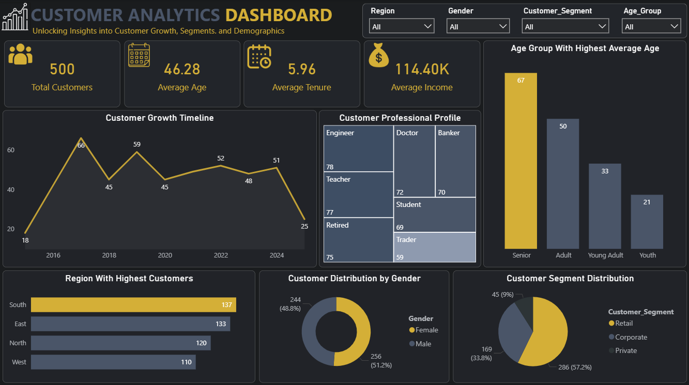

# Customer Analytics Dashboard

## Project Overview
An executive Power BI dashboard designed to analyze customer demographics, acquisition growth trends, regional hub concentrations, and financial profiles. The dashboard tracks performance across **500 customers** to deliver actionable insights into income distribution, age demographics, and professional segmentation.

---

## Key Metrics & Performance Indicators
* **Total Customers:** 500
* **Average Age:** 46.28 years
* **Average Tenure:** 5.96 years
* **Average Income:** $114.40K
* **Top Geographic Region:** South Region (137 customers)
* **Dominant Customer Segment:** Retail (57.2% / 286 customers)
* **Highest Average Age Group:** Senior (Avg Age: 67)

---

## Workflow & Technical Approach
1. **Initial Data Cleaning & Hygiene (Excel):** Standardized demographic values, verified customer records, and formatted numerical profiles.
2. **Data Transformation & Modeling (Power Query):** Cleaned null values, bucketed age brackets (Senior, Adult, Young Adult, Youth), and established relational structures.
3. **DAX Measures & Calculations:** Developed custom DAX measures for aggregate counts, weighted tenure averages, income metrics, and dynamic filter conditions.
4. **UI/UX Design & Wireframing (PowerPoint):** Built a custom dark-mode canvas layout utilizing container cards, monochromatic visual elements, and high-contrast gold indicators.
5. **Dashboard Engineering (Power BI):** Assembled dynamic slicers (Region, Gender, Customer Segment, Age Group), dual-axis trend line charts, treemaps for professional profiles, donut charts, and custom KPI cards.

---

## Key Business Insights & Recommendations
* **Regional Hubs:** The **South (137)** and **East (133)** regions drive the highest customer volume. Management should concentrate marketing initiatives and operational expansion in these primary hubs.
* **Market Segmentation:** **Retail** makes up **57.2%** of the entire customer base, followed by **Corporate (33.8%)** and **Private (9%)**. Value-tier engagement strategies should prioritize Retail retention while building targeted expansion campaigns for Corporate accounts.
* **Professional & Financial Alignment:** Engineers, Doctors, Teachers, and Bankers represent significant portions of the occupational base. Premium financial product offerings can be structured to align with the high average income ($114.40K) observed across these professions.

---

## Repository Files
* `Customer_Analytics_Dashboard.png` — High-resolution screenshot of the Power BI dashboard layout.
* `Customer Segmentation Analysis Report.pdf` — Executive summary report detailing data findings and strategic recommendations.
* `Customer Analytics Dashboard.pbix` — Interactive Power BI workbook file.
